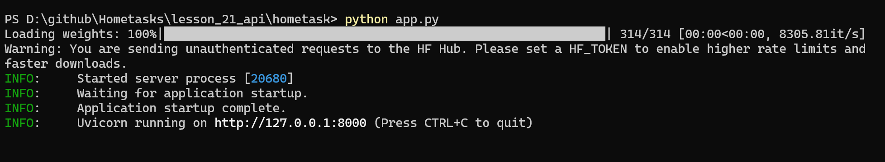
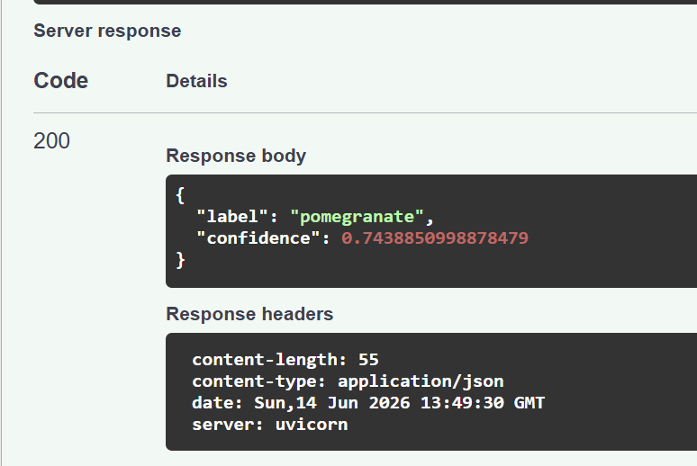

# Homework: Computer Vision API

## Overview
This project implements a REST API for automatic image classification. The system uses a pre-trained MobileNet model to identify objects in images.

## Deployment info
The server is deployed locally using FastAPI.
Address: http://127.0.0.1:8000

## Installation instruction
1. Install Python 3.x.
2. Install the necessary dependencies:
   pip install fastapi uvicorn pillow transformers tensorflow
3. Run the project using the command:
   python app.py

## Modeling info
The project uses the `google/mobilenet_v2_1.0_224` model from the Hugging Face Transformers library. It is a lightweight and efficient neural network designed for image classification tasks.

## Interface description
- Endpoint: POST /predict
- Input: Image file (JPG/PNG formats).
- Output: JSON object containing the object name ("label") and the model's confidence level ("confidence").
- Functionality: Receives an image from the user, processes it through the model, and returns the classification result.

## Example of processing

